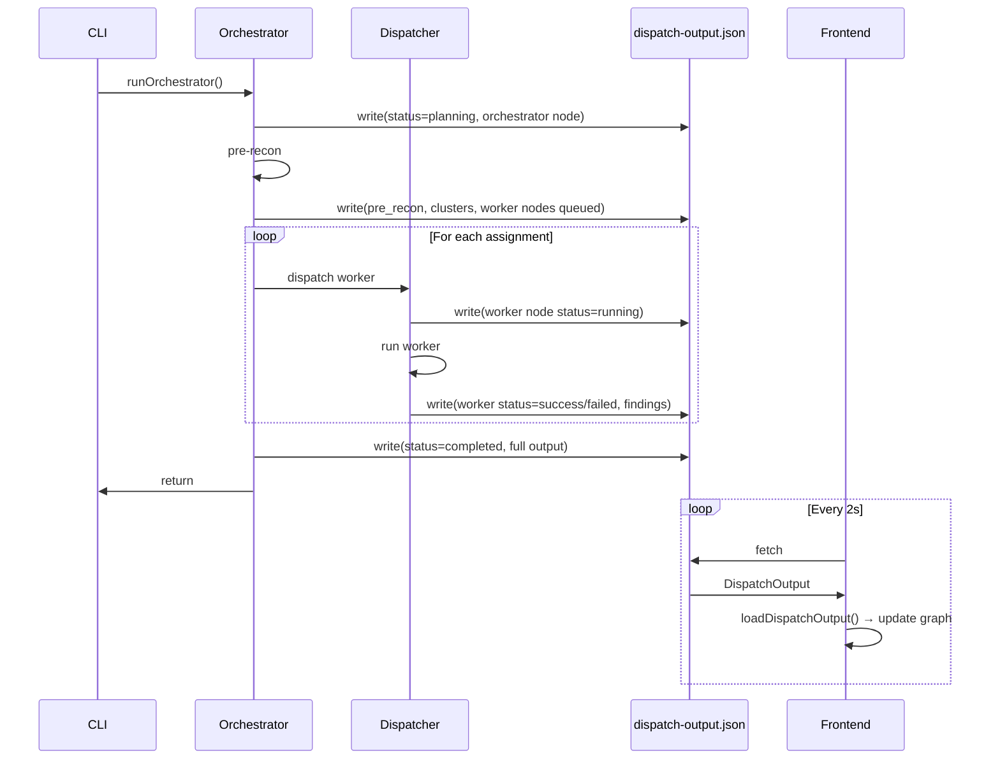

# Frontend–Backend Integration Analysis

> **Generated:** 2026-03-14  
> **Skills used:** Surveyor (traceability, data flow) + Brainstormer (integration options)

---

## 1. Direct Answer: Current State

**Frontend (Next.js)** and **backend (CLI + orchestrator)** are not integrated. The frontend uses mock data; the backend writes a different schema to a different location. No real-time agent graph exists.

| Aspect | Frontend | Backend |
|--------|----------|---------|
| **Data source** | Polls `/dispatch-output.json` every 2s | Writes `MergedReport` to `backend/dispatch-output.json` |
| **Schema expected** | `DispatchOutput` (graph_data, pre_recon, task_assignments, finding_reports, metrics) | `MergedReport` (findings, summary, worker_errors) |
| **Graph model** | Orchestrator → Clusters → Workers → Findings | None — no graph_data built |
| **File location** | `frontend/public/dispatch-output.json` | `backend/dispatch-output.json` (also copied to `backend/src/dashboard/public/`) |

---

## 2. Logic Path: Data Flow

### Backend (current)

```
cli.ts scan
  → runOrchestrator({ targetDir, mode, outputPath })
    → Phase 0: runPreRecon() — sync
    → Phase 1: buildAttackMatrix() + createTaskAssignments() — sync
    → Phase 2: dispatchWorkers(assignments) — sync loop (local) or Promise.allSettled (blaxel)
      → runLocalWorker() / runBlaxelWorker() per assignment
    → Phase 3: mergeReports() — sync
    → fs.writeFileSync(outputPath, JSON.stringify(mergedReport)) — ONCE at end
  → fs.copyFileSync(outputPath, dashboard/public/dispatch-output.json)
```

**Key observation:** The orchestrator writes output only once, after all workers complete. There is no hook when a worker is launched or completes.

### Frontend (current)

```
DispatchWorkspaceProvider
  → useEffect: setInterval(refreshData, 2000)
  → refreshData: fetch("/dispatch-output.json")
  → loadDispatchOutput(data) — expects DispatchOutput
  → If fetch fails: uses mock data (getMockGraphData, getMockFindings, etc.)
```

**Key observation:** `loadDispatchOutput` expects `graph_data`, `task_assignments`, `finding_reports`, `pre_recon`. The backend never provides these. The frontend falls back to mocks.

---

## 3. Graph Model Alignment

### Frontend graph types (`graphTypes.ts`)

- **Node types:** `orchestrator`, `cluster`, `worker`, `finding`
- **Node statuses:** `idle`, `queued`, `planning`, `running`, `warning`, `failed`, `success`, `fixer`, `retestVerified`
- **Edges:** `orchestrator` → `cluster` → `worker` → `finding`

### Backend reality

- **Orchestrator:** One per run
- **Clusters:** Frontend mock uses `auth`, `injection`, `config`, `fixer`, `retest`, `reporting`. Backend has only **pentester workers** grouped by `attack_type` (sql-injection, xss, broken-auth, idor, etc.)
- **Workers:** One per `TaskAssignment` (worker_id, attack_type, target.endpoint)
- **Findings:** From `FindingReport.findings` per worker, merged in collector

### Mapping

| Frontend concept | Backend source |
|------------------|----------------|
| Orchestrator node | `dispatch_run_id` |
| Cluster | Group by `attack_type` (e.g. `sql-injection`, `xss`, `broken-auth`) |
| Worker node | `TaskAssignment.worker_id` + status from `WorkerResult` |
| Finding node | `Finding.finding_id` |
| Edge orchestrator→cluster | Derived from assignments |
| Edge cluster→worker | Assignment belongs to cluster |
| Edge worker→finding | Finding came from worker's report |

---

## 4. Priority #1: Live Agent Graph

**User goal:** When the orchestrator launches a background agent, the frontend should show a new node for that agent.

### Option A: Incremental file writes (recommended)

Orchestrator writes `dispatch-output.json` at each phase. Frontend polls every 2s and sees updates.

**Hooks to add:**

| Phase | When | Write |
|-------|------|-------|
| Start | Before pre-recon | `{ dispatch_run_id, status: "planning", started_at, graph_data: { orchestrator node } }` |
| Pre-recon done | After runPreRecon | Add `pre_recon`, `planPreviewItems` |
| Attack matrix done | After createTaskAssignments | Add `task_assignments`, clusters + worker nodes (status: `queued`) |
| Worker launched | Before runLocalWorker / runBlaxelWorker | Update worker node status → `running` |
| Worker completed | After each worker returns | Update worker node → `success`/`failed`, add finding nodes |
| All done | After mergeReports | `status: "completed"`, `completed_at`, `finding_reports`, `findings`, `metrics` |

**Implementation sketch:**

1. **Backend:** Add `DispatchOutputWriter` or callback passed to `runOrchestrator`:
   - `onPhaseStart(phase)` 
   - `onWorkerDispatched(assignment)` 
   - `onWorkerComplete(result)`
   - `onComplete(result)`

2. **Backend:** Build `graph_data` from `preRecon`, `assignments`, `workerResults`, `mergedReport`:
   - `buildGraphData(preRecon, assignments, workerResults, mergedReport): GraphData`

3. **Backend:** Write full `DispatchOutput` (not just `MergedReport`) to `outputPath` at each hook.

4. **File sharing:** Ensure frontend can read the file:
   - **Option 4a:** Copy/symlink from backend output to `frontend/public/dispatch-output.json`
   - **Option 4b:** Add Next.js API route `GET /api/dispatch-output` that reads from backend path (requires config for path)
   - **Option 4c:** Run a small Express server that serves the file; frontend points to it

### Option B: SSE / WebSocket

Backend runs an HTTP server. Orchestrator pushes events; frontend subscribes.

- **Pros:** True real-time, no polling
- **Cons:** New server, more moving parts, CLI scan would need to start server or connect to existing one

### Option C: Background scan API

Replace CLI with `POST /api/scan` that runs orchestrator in background. Same incremental writes, but output path is known.

---

## 5. What Else Needs to Be Hooked Up

| # | Item | Current | Needed |
|---|------|---------|--------|
| 1 | **Output schema** | Backend writes `MergedReport` | Backend must write full `DispatchOutput` |
| 2 | **graph_data** | Never built | Add `buildGraphData()` in backend |
| 3 | **Incremental updates** | Single write at end | Write at each phase + worker dispatch/complete |
| 4 | **File path** | Backend: `backend/`, dashboard: `backend/src/dashboard/public/` | Frontend needs same file. Copy to `frontend/public/` or use API proxy |
| 5 | **Run status** | Not in MergedReport | Add `status`, `started_at` to output |
| 6 | **task_assignments** | Not written | Include in output |
| 7 | **finding_reports** | Not written (only merged) | Include per-worker reports |
| 8 | **pre_recon** | Not written | Include in output |
| 9 | **metrics** | Not in MergedReport | Add `RunMetrics` (routesDiscovered, workersActive, findingsFound, etc.) |
| 10 | **Backend dashboard as page** | Separate Vite app | Add route `/dashboard` that embeds or links to it — no changes to dashboard code |

---

## 6. buildGraphData() Specification

```typescript
function buildGraphData(
  dispatchRunId: string,
  preRecon: PreReconDeliverable,
  assignments: TaskAssignment[],
  workerResults: WorkerResult[],
  mergedReport: MergedReport | null
): GraphData {
  const nodes: Record<NodeId, GraphNode> = {};
  const edges: GraphEdge[] = [];
  const clusters: Record<ClusterId, GraphCluster> = {};

  // 1. Orchestrator node
  const orchestratorId = "orchestrator";
  nodes[orchestratorId] = { id: orchestratorId, label: "Orchestrator", type: "orchestrator", status: "running", ... };

  // 2. Clusters by attack_type
  const attackTypes = [...new Set(assignments.map(a => a.attack_type))];
  for (const at of attackTypes) {
    const cid = at; // or slugify
    clusters[cid] = { id: cid, label: `${at} Workers`, type: "cluster", status: "..." };
    nodes[cid] = { ... };
    edges.push({ from: orchestratorId, to: cid, kind: "orchestrator" });
  }

  // 3. Worker nodes
  const resultMap = new Map(workerResults.map(r => [r.workerId, r]));
  for (const a of assignments) {
    const wid = a.worker_id;
    const res = resultMap.get(wid);
    const status = !res ? "queued" : res.error ? "failed" : "success";
    nodes[wid] = { id: wid, label: `${a.attack_type}: ${a.target.endpoint}`, type: "worker", clusterId: a.attack_type, status, ... };
    edges.push({ from: a.attack_type, to: wid, kind: "worker" });
  }

  // 4. Finding nodes
  for (const f of mergedReport?.findings ?? []) {
    nodes[f.finding_id] = { id: f.finding_id, label: `${f.vuln_type}: ${f.location.endpoint}`, type: "finding", severity: ..., meta: { finding: f }, ... };
    // Edge from worker that produced it — need worker_id from finding_reports
    edges.push({ from: workerId, to: f.finding_id, kind: "finding" });
  }

  return { nodes, edges, clusters };
}
```

---

## 7. Recommended Implementation Order

1. **Backend: buildGraphData()** — Pure function, testable. Input: orchestrator result. Output: GraphData.
2. **Backend: Full DispatchOutput** — Change final write to include pre_recon, task_assignments, finding_reports, findings, metrics, graph_data.
3. **Backend: Incremental writes** — Add `onPhase` / `onWorkerDispatched` / `onWorkerComplete` callbacks; write at each step.
4. **File sharing** — Copy output to `frontend/public/dispatch-output.json` when running scan (or document that user must run scan from monorepo root with output path pointing to frontend public).
5. **Frontend: Remove mock fallback** — When fetch returns valid DispatchOutput, use it. When 404/empty, show "No active run" instead of mocks.
6. **Frontend: Dashboard page** — Add `/dashboard` route that either iframes `backend/src/dashboard` dev server or links to it.

---

## 8. Edge Cases

| Case | Behavior |
|------|----------|
| Scan not started | Frontend polls, gets 404 or stale file. Show "No active run" or last run. |
| Scan in progress | Incremental writes; frontend sees new nodes every 2s. |
| Worker fails | Worker node status = `failed`; no finding nodes from that worker. |
| No findings | graph_data has orchestrator + clusters + workers; finding nodes empty. |
| Multiple scans | Overwrites same file. Frontend shows latest. For history, need separate storage. |

---

## 9. Mermaid: Target Data Flow



---

## 10. Summary

| Priority | Task | Effort |
|----------|------|--------|
| **#1** | Incremental writes + graph_data when orchestrator dispatches/completes workers | Medium |
| 2 | Backend emits full DispatchOutput schema | Small |
| 3 | buildGraphData() from orchestrator result | Medium |
| 4 | File path: copy to frontend public or API proxy | Small |
| 5 | Frontend: graceful handling when no data | Small |
| 6 | Add backend dashboard as /dashboard page | Small |

The main integration is the **live agent graph**: orchestrator must write incremental updates and build graph_data so the frontend can render nodes as workers are launched and complete.
