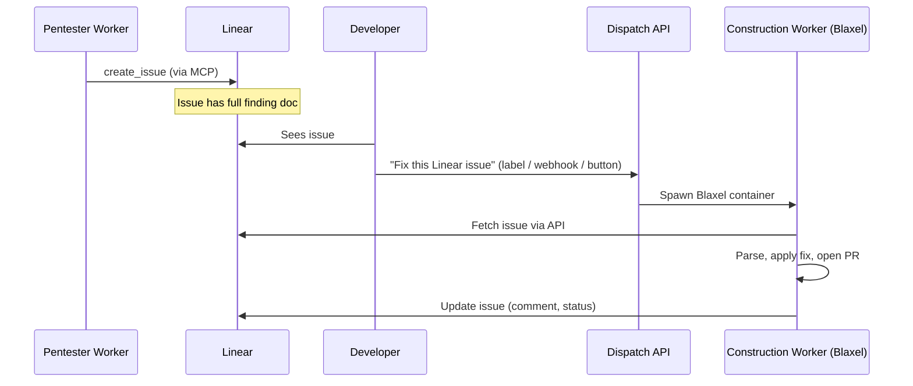

# Linear Demo Integration — Setup Map

> **Generated:** 2026-03-14  
> **Purpose:** Map out what's involved in the demo flow: agents raise issues in Linear → developer sees issue → spins up Dispatch construction worker in Blaxel from Linear.

---

## 1. The Demo Flow (Target State)



---

## 2. What You Need to Give Me

### 2.1 Linear Credentials & Config

| Item | Purpose | Where to get it |
|------|---------|-----------------|
| **Linear API key** | Create/read issues programmatically | Linear → Settings → Account → [API](https://linear.app/settings/api) |
| **Linear team ID** | Which team to create issues in | Linear → Team settings → URL or API |
| **Linear workspace** | OAuth / MCP auth | Same as above |

For MCP (agent creating issues): Linear's official MCP uses **OAuth 2.1** or **API key**. Jules uses API key; Cursor/Claude use OAuth. For a demo, API key is simplest.

### 2.2 Repo & App Config

| Item | Purpose |
|------|---------|
| **GitHub repo** (owner/repo) | Where construction worker will clone, branch, open PR |
| **App config** | `install`, `start`, `port`, `seed` — same as pentester flow |
| **GitHub PAT** | For constructor to clone, push, open PR |

### 2.3 Blaxel

| Item | Purpose |
|------|---------|
| **Blaxel API key** | `BL_API_KEY` or equivalent — already used for pentester |
| **Region** | `BL_REGION` (e.g. `us-pdx-1`) |

---

## 3. MCP Documentation You Need

### 3.1 Linear MCP (Runtime — for agents creating issues)

| Source | URL | What it gives |
|--------|-----|---------------|
| **Linear MCP docs** | [linear.app/docs/mcp](https://linear.app/docs/mcp) | Setup, auth (OAuth/API key), client config |
| **MCP config** | Already in `mcp-and-documentation-strategy.md` | `npx mcp-remote https://mcp.linear.app/mcp` |

**Tools available** (from your docs): `create_issue`, `update_issue`, `list_issues`, `create_comment`, `list_projects`, `list_teams`, `list_labels`.

**Auth options:**
- **OAuth** — for Cursor/Claude connectors (user logs in once)
- **API key** — for headless/agent use; create at [linear.app/settings/api](https://linear.app/settings/api)

### 3.2 Linear REST/GraphQL (for our backend)

| Source | Purpose |
|--------|---------|
| [Linear GraphQL API](https://developers.linear.app/docs/graphql/working-with-the-graphql-api) | Fetch issue by ID, update status, add comment |
| [Linear TypeScript SDK](https://github.com/linear/linear) | `@linear/sdk` — typed client |
| Context7 | `resolve-library-id: linear-sdk` for build-time docs |

### 3.3 Blaxel (already in use)

| Source | Purpose |
|--------|---------|
| `docs.blaxel.ai` | Sandbox creation, `fs`, `process` |
| `@blaxel/mastra` | Mastra integration if needed |
| Existing `dispatcher.ts` | Pattern for `runBlaxelWorker` |

---

## 4. What Needs to Be Implemented

### 4.1 Phase A: Agents Create Issues in Linear

| Component | Status | Work |
|-----------|--------|------|
| **Orchestrator → Linear MCP** | Not implemented | Add Linear MCP as runtime tool for orchestrator |
| **Create issue from finding** | GitHub only | New: `createLinearIssueFromFinding()` using Linear API or MCP |
| **Issue body format** | GitHub schema exists | Reuse same YAML frontmatter + markdown (see `github-issue-schema.md`) — Linear supports markdown |
| **Labels** | GitHub labels | Linear has labels; map `severity:high` → Linear label or custom state |

**Decision:** Create in **both** Linear and GitHub, or **Linear only** for demo?
- **Both:** Keeps existing constructor flow (GitHub) and adds Linear for visibility.
- **Linear only:** Requires constructor to read from Linear instead of GitHub (see 4.2).

### 4.2 Phase B: Constructor Triggered from Linear Issue

Current constructor expects:
- `ConstructorBootstrap.github_issue.repo` + `.number`
- Fetches issue via Octokit, parses body

**Two approaches:**

#### Option B1: Linear as Source of Truth (Linear-only demo)

| Change | Description |
|--------|-------------|
| **ConstructorBootstrap** | Add `linear_issue?: { issue_id: string }` or switch to `issue_source: 'github' \| 'linear'` |
| **Parse Linear issue** | Linear issue `description` uses same markdown format — `parseIssueBody()` can stay, input comes from Linear API |
| **No GitHub issue** | Constructor still opens PR on GitHub; just doesn't comment on GitHub issue. Instead: update Linear issue (comment, status) |
| **Linear API client** | Add `@linear/sdk` or GraphQL client to fetch issue by ID |

#### Option B2: Sync Linear ↔ GitHub (Hybrid)

| Change | Description |
|--------|-------------|
| **On create** | Create Linear issue AND GitHub issue; store `github_issue_number` in Linear issue (e.g. in description or custom field) |
| **Constructor** | Still triggered with GitHub issue; no changes to constructor |
| **"Send Dispatch Workers"** | From Linear, we need to know the linked GitHub issue to bootstrap constructor |

### 4.3 Phase C: "Send Dispatch Workers" — How Developer Triggers

The doc says: *"from a ticket, you can click **Send Dispatch Workers**"*. Linear does **not** have built-in custom buttons. Options:

| Option | Mechanism | Pros | Cons |
|--------|------------|------|------|
| **C1: Linear Webhook** | Developer adds label `dispatch:fix` (or similar) → Linear webhook fires → our endpoint receives POST | No UI work in Linear | Requires webhook endpoint, label discipline |
| **C2: Linear Slack integration** | "Create Linear issue from Slack" exists; we'd need "from Linear, post to our API" — possible via Zapier/Relay | Uses existing integrations | Extra setup, not in-Linear |
| **C3: Dispatch API + Dashboard** | Developer opens Dispatch dashboard, pastes Linear issue URL, clicks "Run construction worker" | Full control, no Linear config | Not "in Linear" |
| **C4: Linear comment trigger** | Developer comments `@dispatch fix` or `/dispatch-fix` | Feels native | Linear doesn't support slash commands; would need webhook on comment + parse |
| **C5: External "Fix" link** | Put `https://dispatch.example.com/fix?linear_issue=xxx` in issue description or as integration | One click from issue | Link lives in description, not a button |

**Recommendation for demo:** **C1 (webhook)** or **C5 (link)**.
- **C1:** Webhook on "Issue updated" when label `dispatch:fix` is added. Our endpoint: `POST /webhooks/linear` → validate signature → spawn construction worker.
- **C5:** When we create the Linear issue, append a link: `[🔧 Run Dispatch Fixer](https://your-dispatch-api.com/fix?linear=ISSUE-123)`. Developer clicks → our API spawns worker.

### 4.4 Phase D: Construction Worker in Blaxel

| Component | Status | Work |
|-----------|--------|------|
| **Pentester in Blaxel** | Done | `runBlaxelWorker()` in `dispatcher.ts` |
| **Constructor in Blaxel** | Not done | New: `runBlaxelConstructor()` analogous to pentester |
| **Constructor input** | File + env | Write `constructor-bootstrap.json` to sandbox, run constructor CLI |
| **Repo clone** | Constructor needs repo | Blaxel sandbox: `git clone` or upload; pentester uploads app dir — constructor needs git + push capability |

**Blaxel constructor flow:**
1. Create sandbox
2. Clone repo (or receive via upload)
3. Write `constructor-bootstrap.json` (with `linear_issue.id` or `github_issue`)
4. Run `npx tsx src/workers/constructor/cli.ts /path/to/bootstrap.json`
5. Constructor fetches issue (Linear or GitHub), applies fix, opens PR
6. Read result, update Linear issue, delete sandbox

**Git in Blaxel:** Constructor must `git clone`, `git checkout -b`, `git push`. Need GitHub PAT in sandbox env.

---

## 5. Implementation Checklist

### 5.1 Linear Setup (Your Side)

- [ ] Create Linear API key
- [ ] Create team (or use existing)
- [ ] Optional: Create webhook in Linear (Settings → API → Webhooks) pointing to `https://your-dispatch-api.com/webhooks/linear`
- [ ] Optional: Create label `dispatch:fix` for webhook trigger

### 5.2 What I Need From You

| Delivered | Format |
|-----------|--------|
| Linear API key | Env var `LINEAR_API_KEY` |
| Linear team ID/key | Env var `LINEAR_TEAM_ID` or team key (e.g. `ENG`) |
| GitHub repo | `owner/repo` |
| GitHub PAT | For constructor (clone, push, PR) |
| Blaxel credentials | Already in use? |
| Webhook URL | If using webhooks: public HTTPS URL for your Dispatch API |

### 5.3 Code Work (Rough Order)

1. **Linear issue creation** — Add `createLinearIssueFromFinding()` using Linear SDK or MCP; call from orchestrator after merge.
2. **Linear issue schema** — Reuse GitHub issue body format (YAML frontmatter + markdown) so constructor can parse.
3. **Constructor: Linear source** — Extend `ConstructorBootstrap` to support `linear_issue: { id }`; add `fetchLinearIssue()`; parse same body format.
4. **Constructor: Linear updates** — After fix, add comment to Linear issue, update status.
5. **Blaxel constructor** — Implement `runBlaxelConstructor()` mirroring pentester flow.
6. **Trigger endpoint** — `POST /api/fix` or `GET /fix?linear=ISSUE-123` that spawns Blaxel constructor.
7. **Webhook handler** (optional) — `POST /webhooks/linear` with signature verification, filter for `dispatch:fix` label.

---

## 6. Architecture Diagram

```
┌─────────────────────────────────────────────────────────────────────────┐
│                         DISPATCH DEMO FLOW                               │
├─────────────────────────────────────────────────────────────────────────┤
│                                                                          │
│  ┌──────────────┐     Linear MCP      ┌──────────────┐                   │
│  │  Orchestrator │ ─────────────────► │    Linear    │                   │
│  │  (or Agent)   │  create_issue      │   (issues)    │                   │
│  └──────────────┘                     └──────┬───────┘                   │
│                                              │                            │
│                                              │ Developer sees issue       │
│                                              ▼                            │
│  ┌──────────────┐   Label / Link /    ┌──────────────┐                   │
│  │  Webhook or  │ ◄─────────────────  │   Linear     │                   │
│  │  /fix API    │   "dispatch:fix"    │   (trigger)  │                   │
│  └──────┬───────┘   or click link     └──────────────┘                   │
│         │                                                                 │
│         │ Spawn                                                          │
│         ▼                                                                 │
│  ┌──────────────────────────────────────────────────────────────────┐   │
│  │              Blaxel Sandbox (Constructor)                         │   │
│  │  • Fetch Linear issue via API                                    │   │
│  │  • Parse finding (same format as GitHub)                          │   │
│  │  • Clone repo, apply fix, open PR                                 │   │
│  │  • Comment on Linear issue with result                            │   │
│  └──────────────────────────────────────────────────────────────────┘   │
│                                                                          │
└─────────────────────────────────────────────────────────────────────────┘
```

---

## 7. Risks & Open Questions

| Risk | Mitigation |
|------|-------------|
| Linear MCP auth in headless agent | Use API key; MCP may need `mcp-remote` with API key in headers — verify Linear MCP docs for server-to-server |
| Constructor needs git push | GitHub PAT with `repo` scope in Blaxel sandbox env |
| Webhook URL must be public | Use ngrok for local demo, or deploy to public host |
| Linear issue body format | Strictly match GitHub schema (YAML + tables) so `parseIssueBody()` works unchanged |

---

## 8. Summary: Minimal Demo Path

**Fastest path to demo:**

1. **You provide:** Linear API key, team ID, GitHub repo, GitHub PAT.
2. **I implement:**
   - Orchestrator creates Linear issues (in addition to or instead of GitHub) with same body format.
   - `POST /api/fix` accepts `linear_issue_id`, spawns Blaxel constructor.
   - Constructor reads from Linear, applies fix, opens PR on GitHub, comments on Linear.
3. **Demo flow:** Run scan → issues appear in Linear → you paste issue ID into our API or click a link we embed → construction worker runs in Blaxel → PR + Linear comment.

**"Send Dispatch Workers" in Linear:** For a polished demo, add the webhook + label flow so adding `dispatch:fix` triggers the worker without leaving Linear.
