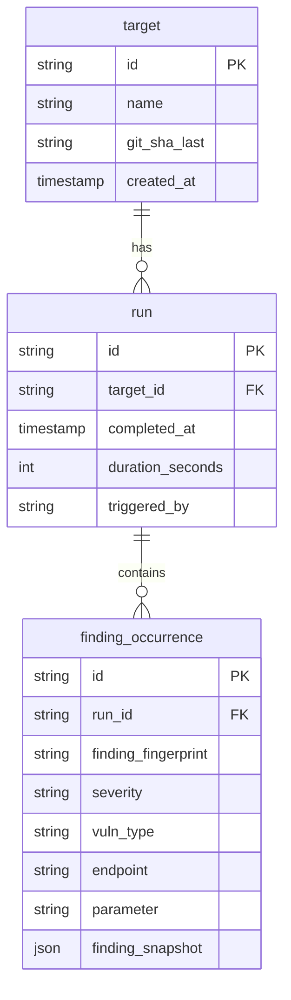
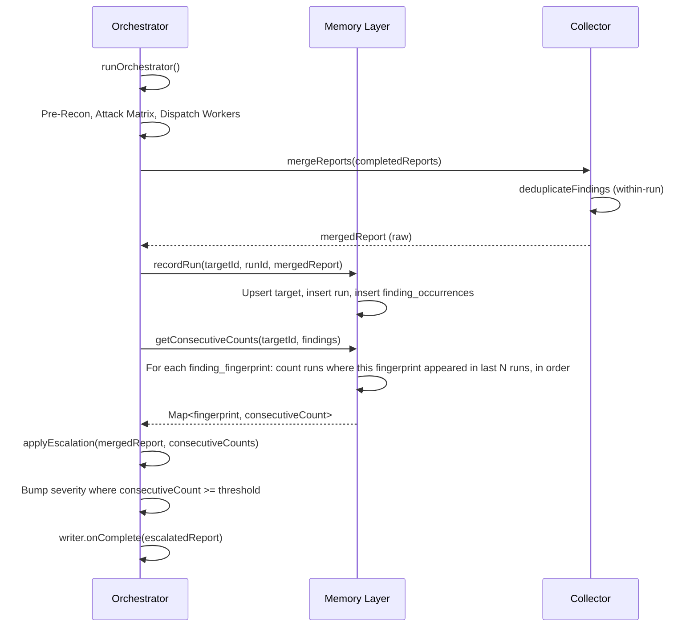

# Cross-Run Memory Layer Design

**Status:** Design / Pitch  
**Goal:** Enable the orchestrator to say *"this endpoint has been flagged in 4 consecutive scans, bump it to Critical"* rather than treating every scan in isolation.

---

## 1. Current State

Today, Dispatch operates in **run-isolated** mode:

```
┌─────────────────────────────────────────────────────────────────────────────┐
│  Single Run Flow                                                             │
├─────────────────────────────────────────────────────────────────────────────┤
│  Pre-Recon → Attack Matrix → Dispatch Workers → mergeReports() → Output      │
│                                                                              │
│  • Deduplication: within-run only (endpoint + parameter + vuln_type)         │
│  • Output: dispatch-output.json (overwritten each run)                       │
│  • Datadog: time-series metrics, no per-finding history                     │
│  • Slack: returns fresh findings for that run only                          │
└─────────────────────────────────────────────────────────────────────────────┘
```

**Gap:** No persistence of findings across runs. The orchestrator cannot:
- Recall that `/api/orders?id=` was flagged in runs 1, 2, and 3
- Escalate severity based on recurrence
- Tell Slack *"Worker 3 found the same pattern in the last 3 scans"*

---

## 2. Memory Layer Concept

The memory layer is a **persistent store** that:

1. **Records** each run’s findings, keyed by target + canonical finding identity
2. **Queries** historical occurrences for a given endpoint/pattern
3. **Feeds** the orchestrator and Slack with cross-run context

### Core Capabilities

| Capability | Description | Consumer |
|------------|-------------|----------|
| **Record** | Persist findings from each completed run | Orchestrator (post-merge) |
| **Recall** | "What runs saw this endpoint/pattern?" | Orchestrator (pre/post merge), Slack |
| **Consecutive detection** | "How many runs in a row have flagged this?" | Escalation logic |
| **Escalation** | Bump severity when recurrence threshold hit | Orchestrator (merge phase) |

---

## 3. Data Model

### 3.1 Canonical Finding Identity

Today’s `generateFindingKey` in `collector.ts`:

```ts
// endpoint:parameter:vuln_type → 12-char hash
const raw = `${finding.location.endpoint}:${finding.location.parameter || ''}:${finding.vuln_type}`;
```

For cross-run memory we need a **target-scoped** identity. A target is the app being scanned (e.g. `flask-target`, `sample-app`, or a repo path).

```
target_id + endpoint + parameter + vuln_type → finding_fingerprint
```

**Target ID** options:
- `path.basename(targetDir)` — simple, works for local paths
- `git remote URL` or `owner/repo` — better for multi-environment
- Configurable: `DISPATCH_TARGET_ID` env var, fallback to basename

### 3.2 Entity Relationship



### 3.3 Key Tables (SQL)

```sql
-- Targets: one per scanned app/repo
CREATE TABLE targets (
  id TEXT PRIMARY KEY,           -- e.g. "flask-target", "owner/repo"
  name TEXT NOT NULL,
  git_sha_last TEXT,
  created_at TIMESTAMPTZ DEFAULT now()
);

-- Runs: one per orchestrator execution
CREATE TABLE runs (
  id TEXT PRIMARY KEY,           -- dispatch_run_id
  target_id TEXT NOT NULL REFERENCES targets(id),
  completed_at TIMESTAMPTZ NOT NULL,
  duration_seconds INT,
  triggered_by TEXT,             -- slack, dashboard, github, api
  findings_count INT,
  critical_count INT,
  high_count INT
);

-- Finding occurrences: one row per (run, finding_fingerprint)
CREATE TABLE finding_occurrences (
  id TEXT PRIMARY KEY,
  run_id TEXT NOT NULL REFERENCES runs(id),
  finding_fingerprint TEXT NOT NULL,  -- hash(endpoint, param, vuln_type)
  severity TEXT NOT NULL,
  vuln_type TEXT NOT NULL,
  endpoint TEXT NOT NULL,
  parameter TEXT,
  finding_snapshot JSONB,        -- full finding for Slack/UI
  UNIQUE(run_id, finding_fingerprint)
);

CREATE INDEX idx_occurrences_fingerprint ON finding_occurrences(finding_fingerprint);
CREATE INDEX idx_occurrences_run ON finding_occurrences(run_id);
CREATE INDEX idx_runs_target_completed ON runs(target_id, completed_at DESC);
```

---

## 4. Integration Points

### 4.1 Orchestrator Flow (Modified)



### 4.2 New Orchestrator Hooks

| Hook | When | Purpose |
|------|------|---------|
| `memory.recordRun()` | After `mergeReports`, before `writer.onComplete` | Persist run + findings |
| `memory.getConsecutiveCounts()` | After record, before final report | Get recurrence per finding |
| `memory.getHistoryForFinding()` | Optional: Slack / API | "This was seen in runs X, Y, Z" |

### 4.3 Escalation Rules (Configurable)

```ts
// Example config
const ESCALATION_RULES = {
  consecutiveScansToCritical: 4,   // HIGH → CRITICAL after 4 consecutive
  consecutiveScansToHigh: 2,       // MEDIUM → HIGH after 2 consecutive
  lookbackRuns: 10,               // Only consider last 10 runs for "consecutive"
};
```

**Consecutive** = appearing in run N, N-1, N-2, ... without gap. If run N-1 didn’t have it (e.g. worker timed out), the streak resets.

---

## 5. Slack Integration

### 5.1 Richer Slack Responses

**Today:**
> Security scan completed. Found 3 findings (1 critical, 2 high).

**With memory:**
> Security scan completed. Found 3 findings (1 critical, 2 high).
> 
> ⚠️ **Recurring:** `POST /api/orders` (SQL injection) has been flagged in **4 consecutive scans** — escalated to Critical.

### 5.2 New Slack Commands (Optional)

| Command | Behavior |
|---------|----------|
| `@Dispatch scan` | Same as today, but response includes recurrence callouts |
| `@Dispatch history /api/orders` | "This endpoint was flagged in runs X, Y, Z (last 10 runs)" |
| `@Dispatch trends` | "Top recurring findings: ..." |

### 5.3 Block Kit Enhancement

Add a "Recurrence" section to finding blocks when `consecutiveCount >= 2`:

```json
{
  "type": "section",
  "text": {
    "type": "mrkdwn",
    "text": "🔁 *Recurring:* Flagged in 4 consecutive scans. Severity escalated from High to Critical."
  }
}
```

---

## 6. Storage Options

### Trade-off Matrix

| Option | Scalability | Complexity | Time-to-Market | Cost | Rationale |
|--------|-------------|------------|----------------|------|-----------|
| **SQLite** (file) | Low (single writer) | Low | Fast | $0 | Boring/proven. Good for single-instance, local or small deployments. |
| **Supabase (Postgres)** | High | Medium | Medium | Free tier → paid | Modern, hosted. Good if Slack app is already cloud-deployed. |
| **Postgres (self-hosted)** | High | Medium | Medium | Infra cost | Full control, no vendor lock-in. |

### Recommendation

- **Phase 1 (MVP):** SQLite in `~/.dispatch/memory.db` or `./.dispatch/memory.db` next to `dispatch-output.json`. Zero infra, works for CLI + single Slack instance.
- **Phase 2 (Scale):** Add Supabase/Postgres adapter when multi-instance or hosted Slack needs it. Abstract behind `MemoryStore` interface.

### Interface Abstraction

```ts
interface MemoryStore {
  recordRun(targetId: string, runId: string, report: MergedReport): Promise<void>;
  getConsecutiveCounts(targetId: string, fingerprints: string[], lookback?: number): Promise<Map<string, number>>;
  getHistoryForEndpoint(targetId: string, endpoint: string, limit?: number): Promise<FindingHistoryEntry[]>;
}
```

---

## 7. Second-Order Effects

| Effect | Mitigation |
|--------|------------|
| **Target ID drift** — same app scanned from different paths | Normalize target ID (e.g. always use `GITHUB_REPO` or `DISPATCH_TARGET_ID` when set) |
| **Schema evolution** — new finding fields | `finding_snapshot` as JSONB allows schema flexibility |
| **Data growth** — runs accumulate | Retention policy: e.g. keep last 90 days, or last 500 runs per target. Add `memory.prune()` |
| **False positives recurring** | Escalation can create noise. Make thresholds configurable; consider "confirmed" vs "unconfirmed" in escalation logic |
| **Consecutive definition** | Document clearly: "consecutive" = no gaps. Consider "appeared in 4 of last 5" as alternative policy |

---

## 8. Implementation Phases

### Phase 1: Persistence + Recall (2–3 days)

1. Add `backend/src/memory/` module
2. SQLite store + `MemoryStore` interface
3. `recordRun()` after merge in orchestrator
4. `getConsecutiveCounts()` — no escalation yet, just logging

### Phase 2: Escalation (1–2 days)

1. Call `getConsecutiveCounts()` in orchestrator
2. `applyEscalation()` in collector or new `escalation.ts`
3. Configurable thresholds via env or config file

### Phase 3: Slack UX (1–2 days)

1. Pass `consecutiveCounts` to Slack response builder
2. Add recurrence callout to `formatFindingsResponse`
3. Optional: `history` / `trends` commands

### Phase 4: Optional Enhancements

- Supabase/Postgres adapter for multi-instance
- Retention/prune job
- Dashboard: "Recurring findings" view
- Webhook when finding hits N consecutive (alert fatigue reduction)

---

## 9. Pitch Summary

**One-liner:** *"Dispatch with a memory layer lets the orchestrator say 'this endpoint has been flagged in 4 consecutive scans, bump it to Critical' instead of treating every scan in isolation."*

**Value props:**
- **Reduced alert fatigue** — recurring issues get escalated instead of repeated at same severity
- **Slack-native** — recurrence surfaced where teams already work
- **Lightweight** — SQLite MVP, no new infra
- **Extensible** — swap to Supabase/Postgres when scaling

**Risks:**
- Escalation thresholds need tuning (too aggressive = noise; too conservative = missed signal)
- Target ID consistency matters — document clearly for users
